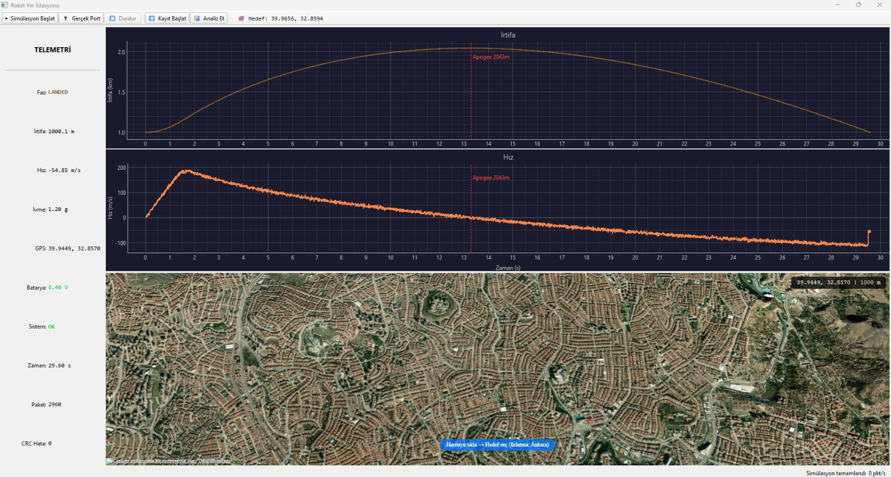

# 🚀 Roket Yer İstasyonu

EuRoC tarzı bir roket yarışması için geliştirdiğim uçuş simülasyonu, log analizi ve gerçek zamanlı yer istasyonu yazılımı.


---

## 📸 Ekran Görüntüsü



> Gerçek zamanlı telemetri paneli, irtifa/hız grafiği ve CesiumJS 3D harita

---

## 🎯 Proje Hakkında

Takımımızın EuRoC yarışmasına hazırlık sürecinde, fırlatma öncesi simülasyon ve fırlatma anında gerçek zamanlı izleme ihtiyacını karşılamak amacıyla bu yazılımı geliştirdim. Gerçek donanım (ESP32/STM32 tabanlı uçuş bilgisayarı) henüz hazır olmadığından, sistem dahili bir simülasyon moduna sahip — yazılım, fizik tabanlı bir simülatörden gelen verileri sanki seri porttan geliyormuş gibi işliyor.

### Özellikler

- **Fizik tabanlı uçuş simülasyonu** — ISA atmosfer modeli, irtifaya bağlı yerçekimi, aerodinamik sürüntü, Euler ve RK4 integrasyon seçeneği
- **Gerçekçi sensör gürültüsü** — IMU bias drift, barometrik Gaussian gürültü + kuantizasyon, GPS jitter
- **Uçuş fazı durum makinesi** — ARMED → LAUNCH_DETECT → ASCENT → APOGEE → DESCENT → LANDED
- **2D balistik simülasyon** — Haritadan hedef seçilince roket Ankara'dan o noktaya doğru gerçekçi balistik yay çizer
- **PyQt6 yer istasyonu arayüzü** — anlık telemetri, irtifa+hız grafiği, uyarı sistemi
- **CesiumJS 3D harita** — uydu görüntüsü, terrain, roket trail, fırlatma/hedef marker
- **$ROCKET paket formatı** — XOR CRC doğrulamalı özel telemetri protokolü
- **Otomatik CSV kayıt** ve uçuş sonrası analiz raporu

---

## 🏗️ Mimari

```
rocket_software/
├── simulation/          # Fizik motoru, gürültü modeli, state machine
├── analysis/            # Log okuyucu, apogee tespiti, rapor üreteci
├── ground_station/
│   ├── core/            # Paket parser, seri port, sim köprüsü, CSV kayıt
│   ├── ui/              # PyQt6 pencere, grafikler, harita widget
│   └── assets/          # CesiumJS, harita şablonu
└── tests/               # pytest test suite (45 test)
```

### Veri Akışı

```
FlightSimulator ──► SimBridge.readline() ──► SerialHandler (QThread)
                                                    │
                                             PacketParser (XOR CRC)
                                                    │
                                    ┌───────────────┼───────────────┐
                                    ▼               ▼               ▼
                             TelemetriPanel   AltitudeWidget   MapWidget
                             (anlık değerler) (irtifa+hız)    (CesiumJS 3D)
```

### Telemetri Paketi

```
$ROCKET,<ts_ms>,<state>,<altitude>,<velocity>,<accel>,<lat>,<lon>,<battery>,<status>*<CRC>
```

---

## ⚙️ Kurulum

**Gereksinimler:** Python 3.11+

```bash
git clone https://github.com/conny0506/roket-yer-istasyonu.git
cd roket-yer-istasyonu/rocket_software
pip install -r requirements.txt
```

> CesiumJS yerel asset'leri için (CDN bağımlılığı yok):
> `ground_station/assets/` klasörüne `Cesium.js`, `widgets.css` ve `qwebchannel.js` dosyalarını kopyalayın.

---

## 🚀 Kullanım

```bash
cd rocket_software

# Yer istasyonunu başlat (simülasyon modunda)
python -m ground_station.main

# Sadece simülasyon çalıştır
python -m simulation.flight_generator

# Testleri çalıştır
pytest tests/ -v
```

### Simülasyon Modu

1. Uygulama açılınca haritada bir hedef noktası seç (Ankara'ya yakın, ~3 km menzil)
2. **"Simülasyon Başlat"** butonuna bas
3. Roket Ankara'dan hedefe doğru balistik yay çizer — kamera otomatik takip eder
4. Uçuş tamamlanınca otomatik analiz raporu açılır

---

## 📊 Fizik Modeli

| Bileşen | Model |
|---|---|
| Atmosfer | ISA troposfer (ρ, T, P irtifaya bağlı) |
| Yerçekimi | Ters kare kanunu (irtifaya göre) |
| Sürüntü | `F_drag = ½ρv²CdA` (sabit Cd) |
| Kütle | Yakıt tükenimli değişken kütle |
| İtki | Eğri interpolasyonlu motor modeli |
| İntegrayon | Forward Euler / RK4 (seçilebilir) |
| Balistik | 2D, Azimuth + bisection ile tilt optimizasyonu |

---

## 🧪 Testler

```bash
pytest tests/ -v
# 45 passed
```

Test kapsamı: paket parser, state machine, log analizi, irtifa tespiti

---

## 📁 Proje Aşamaları

| Aşama | Kapsam | Durum |
|---|---|---|
| 1 | Fizik simülasyonu + CSV çıktısı | ✅ Tamamlandı |
| 2 | Log analizi + rapor üretimi | ✅ Tamamlandı |
| 3 | PyQt6 yer istasyonu + CesiumJS harita | ✅ Tamamlandı |
| 4 | Kalman filtresi, paraşüt sim, donanım entegrasyon | 🔄 Planlandı |

---

## 📄 Lisans

MIT License — dilediğiniz gibi kullanabilirsiniz.
